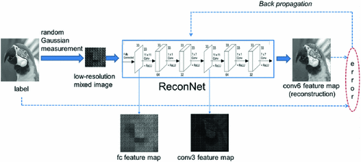
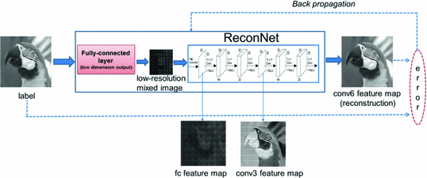

# AdaptiveReconNet
Implementation of **Adaptive ReconNet** in Tensorflow, which was proposed in paper [*Adaptive measurement network for CS image reconstruction*](https://link.springer.com/chapter/10.1007/978-981-10-7302-1_34).

## The network of *Adaptive  ReconNet*
The *Adaptive ReconNet* was originated from the *ReconNet* presented in [*ReconNet:Non-Iterative Reconstruction of Images from Compressively Sensed Random Measurements*](https://arxiv.org/abs/1601.06892), the structure of which is shown below.



1. The structure of *ReconNet*

The main improvement that the *Adaptive ReconNet* makes is that it adds a fully-connected layer to replace the **random Gaussian measurement** part, so that the network should be able to get the measurement matrix all by itself during training. Its corresponding network is shown below.



2. The structure of **Adaptive ReconNet**

The results have been improved dramatically.


3. Improved results

## Prerequisites 
I worte and tested the code under Linux environment. If you want to run it on Windows, you should modify the code to make it executable.

- Python 2.7.13
- Tensorlow 1.4.0
- h5py 2.7.1
- Scipy 1.0.0

## Sample Results
- Source pic

  

- Reconstructed pic (MR=10%)

  


**For yor information**:
	*The block effect* is quite obvious in the comparion, which is because the **non-symmetric padding** that Tensorflow utilizes for computing convolution. A possible tip is, try to expand the convolution size and then cut the edge might eliminate the block effect.

## Usage
### To reproduce the sample
- Run `generate_test.m`/ `generate_train.m` in folder **generate_h5** to get yourself the `test.h5`/`train.h5`  dataset.
- Simply run the `main.py`, and you should get the sample results shown above.

### To test on other pics
- Modify the following part of code (line 71-72) inside funciton `prepare_data` defined in file `utils.py` to choose different test set.
```python
# modify the paras if you want to change test pics
data_dir = os.path.join(os.sep, (os.path.join(os.getcwd(), dataset)), "Set5")
data = glob.glob(os.path.join(data_dir, "*.bmp"))
```
- Modify the following code (line 162) inside function `input_setup` defined in file `utils.py` to specify the number of the test pic.
```python
input_init, label_init = preprocess(data[2], config.scale) # decide which pic to restore
```
- Run `main.py` to perform prediction on the chosen pic.

### To train by yourself
- Modify the `flags` part defined in file `main.py` as below.
  - Change the "stride" entry  from 33 to 14 .
  - Change the "is_train" entry from False to True.
  - Modify the "epoch","batch_size" and "measurement_rate" if you need.

- Run the `main.py` to start training.

## Reference Code
While I was writing this project, I took reference from the following repos:
1. [ReconNet](https://github.com/KuldeepKulkarni/ReconNet), the official implementation of ReconNet written in Matlab, working with Caffe.
2. [SRCNN-Tensorflow](https://github.com/tegg89/SRCNN-Tensorflow), the implementation of SRCNN written in Python, working with Tensorflow.

I do appeciate the generous sharing of the open-source code.

## Notice
This code was finished in August last year(2017). Due to the change to my reserch direction, *Compressed Sensing* or *Reconstructing* are not my study topics any more.**So, this repo will no longer be under maintanence.**

However, if you run into any issue, you're still welcomed to raise it, I will be pleased to answer that for you.
